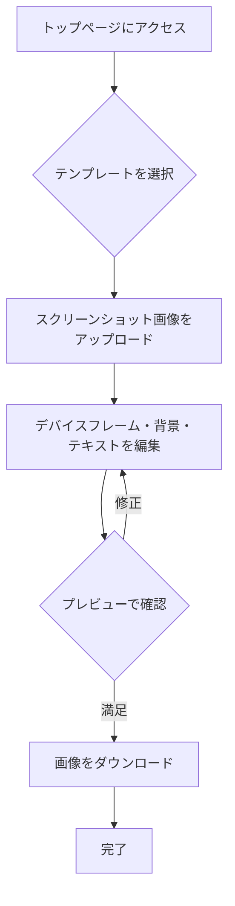

# 機能一覧とユーザーフロー

## MVP機能一覧 (Must have)

| 機能 | 詳細 | 優先度 |
| :--- | :--- | :--- |
| **画像アップロード** | ユーザーがスクリーンショット画像をアップロードできる | 高 |
| **デザインテンプレート選択** | 事前に用意された複数のデザインテンプレートを選択できる | 高 |
| **デバイスフレーム選択** | iPhone, Androidなどのデバイスフレームを選択できる | 高 |
| **テキスト編集** | テンプレート内のタイトルや説明文を編集できる | 高 |
| **背景カスタマイズ** | 背景を単色またはグラデーションから選択・変更できる | 高 |
| **カルーセル生成** | 複数の画像を繋げたカルーセル風の画像を生成できる | 高 |
| **リアルタイムプレビュー** | 編集内容がリアルタイムでプレビューに反映される | 高 |
| **画像ダウンロード** | 生成された画像をPNG形式でダウンロードできる | 高 |
| **レスポンシブデザイン** | PC、タブレット、スマートフォンで快適に操作できる | 中 |

## ユーザーフロー

ユーザーがサービスを利用してから画像をダウンロードするまでの一連の流れを以下に示します。

## 方針

- **シンプルさの追求**: 機能数を絞り、直感的なUIを提供することで、ユーザーが迷うことなく操作できるようにする。
- **テンプレートベース**: ユーザーはデザインの知識がなくても、テンプレートを選ぶだけで高品質なスクリーンショット画像を生成できる。カスタマイズは最小限にする。
- **サーバーレス**: 認証やデータベースはMVPでは導入せず、全ての処理をフロントエンド（ブラウザ）で完結させる。これにより、開発速度を上げ、運用コストを抑える。
